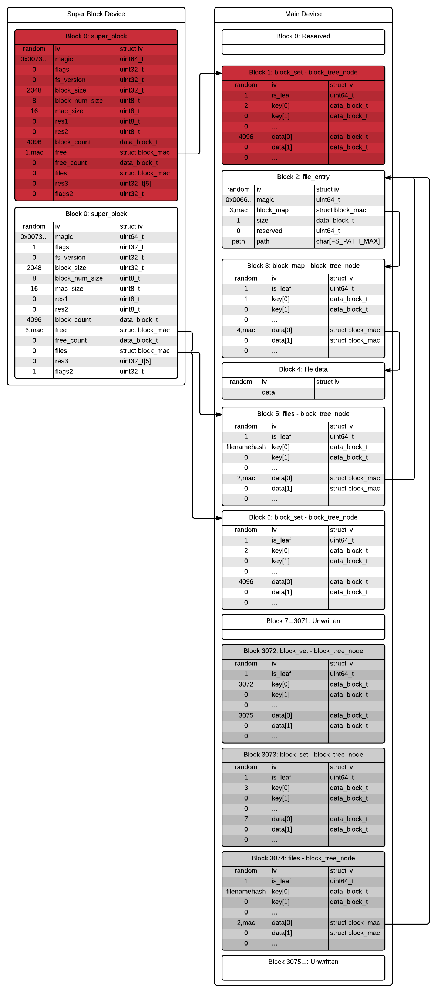

# Secure storage service

## Code Organization

### Misc
- crypt - Encrypt/decrypt, mac and hash fuctions.
- rpmb - MMC rpmb protocol.

### File System Components
- block_device - Low level block IO.
- block_mac - Helper fuctions to bundle block numbers and mac values.
- block_cache - High level block IO.
- super - Superblock load/store and file system initialization.
- block_tree - B+ tree implementation.
- block_set - Set operations built on top of B+ tree.
- block_allocator - Keeps track of free vs allocated blocks.
- transaction - Transaction init and complete code.
- block_map - Maps a logical block number to a physical block number and a mac.
- file - File management.

### IPC Specific Components
- ipc - IPC library
- proxy - Creates port that the non-secure os connects to to provide.
- tipc_ns - Helper functions to send requests to non-secure proxy server.
- block_device_tipc - Implements block operations needed by the file system.
- client_tipc - Implement the secure storage tipc api on top of the file system.

## Disk layout

- Empty file system example.
  

- Active Transaction state after creating a new file and writng one byte to it.
  Note that at this point all the added nodes may only be in the block cache.
  

- State after completing transaction. The second super block is now the most
  recent on. The first super block still points to a valid file system, but
  as soon as the next transaction starts, those block may be reused. Block 3072
  and above may not be on disk and their cache entries are invalid.
  